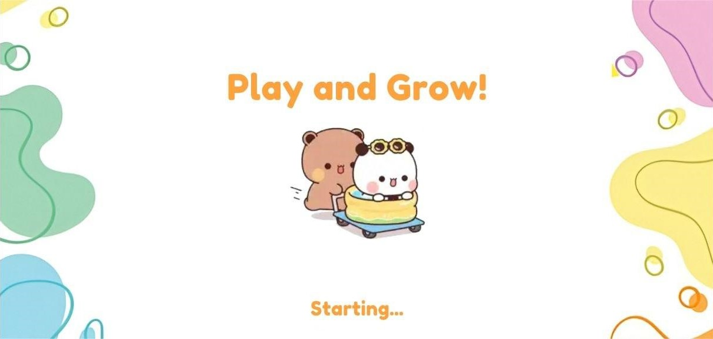

# 🎮 Educational Kids Game

## 📝 Project Description

An interactive educational game designed specifically for children, featuring multiple mini-games that help develop various cognitive skills through fun and engaging activities. The game provides a safe, colorful, and motivating environment where children can learn while playing.

---

## ✨ Key Features

### 🔐 User Management
- **Email Registration**: Simple and secure registration system
- **Persistent Login**: Automatic account saving via **Firebase Authentication**
- **Cloud Storage**: User data stored securely in Firebase Realtime Database
- **User Profile**: Each child has their own personalized profile

### 👾 Character System
- **Avatar Selection**: Multiple character options for children to choose from
- **Name Customization**: Players can name their character
- **Persistent Character**: Selected avatar is saved and appears throughout all game scenes
- **Motivational Companion**: The character stays on screen, reacting and encouraging the player during gameplay

### 🎮 Game Modes

#### 1. **Puzzle Game** 🧩
- Multiple picture options to choose from
- Drag-and-drop piece arrangement with Timed Challenges
- Complete the full image to win

#### 2. **Memory Match** 🃏
- Classic card-flipping memory game
- Find matching pairs of cards
- Develops memory and concentration skills

#### 3. **Math Fun** ➕➖✖️
- Interactive math challenges
- Addition & Subtraction: Basic arithmetic operations
- Multiplication & Division: For advanced learners
- Visual Representations: Numbers shown with colorful graphics
- Instant Feedback: Correct/incorrect animations
- Helps develop:Mental arithmetic skills ,Quick thinking

### 🏆 Rewards & Motivation System
- **Star Ratings**: Earn stars for completing tasks

### 🔊 Audio Experience
- **Background Music**: Age-appropriate music for each game
- **Sound Effects**: Fun sounds for various actions:
  - Clicking/tapping
  - Winning/losing
  - Drawing/dragging
  - Card flipping
  - Puzzle piece placement
- **Volume Control**: Easy audio management in settings

### ⚙️ Settings Menu
- Volume on/off toggle
- Music control
- Sound effects control
- User-friendly interface for children

### 📱 Mobile Support
- Built specifically for Android devices
- **Touch-Friendly**: All interactions designed for touchscreens

---

## 📖 How to Play

1. **Registration**: Enter your email to create an account
2. **Character Selection**: Choose your favorite character (**Bubu** or **Dudu**) and give it a name
3. **Game Selection**: Pick from three exciting games
4. **Play & Learn**: Complete challenges

---
## 📸 Screenshots 

**Loading**

---
## Try it now and have fun learning! 🎮✨

**Download the Game** [Download APK]()

---

## 👥 Authors & Contributors

- [Jannah Ayman](https://github.com/jannah-ayman)
- [Rawan Sotohy](https://github.com/Rawan-Sotohy)
- [Nancy Saad](https://github.com/nancyabdelbaryy)

---

**Made with ❤️ for children's education and entertainment**
